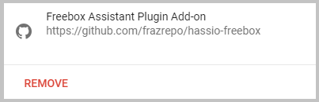
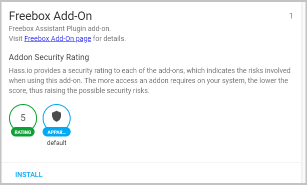
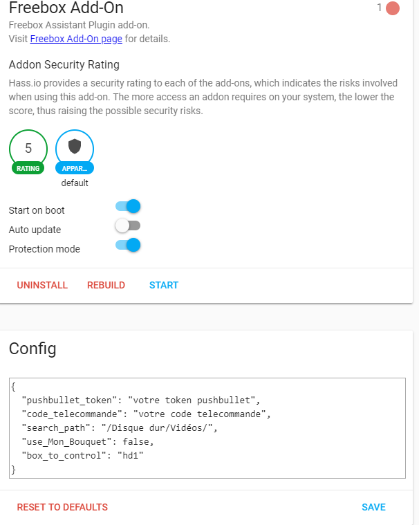
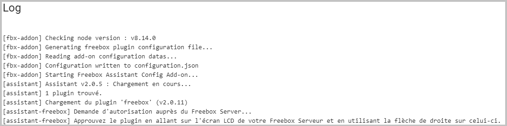

## hassio-freebox

Un add-on Hassio ([Home Assistant](https://www.home-assistant.io/)) pour [assistant-freebox](https://github.com/Aymkdn/assistant-freebox). assistant-freebox permet de contrôler la FreeBox Revolution via Google Home.

Pour pouvoir utiliser cet add-on (et le plugin) , il vous faut un compte [pushbullet](https://www.pushbullet.com/) et un compte [ifttt](https://ifttt.com/).

## Installation

* Créer et récupérer votre token pushbullet
* Dans hassio, ajouter un nouveau repository en ajoutant l'url : https://github.com/frazrepo/hassio-freebox

* Cliquer sur Install pour installer l'add-on **Freebox Add-On** (Attendre un petit moment le temps qu'il récupère les packages assistant-plugins et assistant-freebox)

* Dans la section Config, renseigner votre token pushbullet, votre code telecommande et éventuellement remplacer hd1 par hd2.

* Cliquer sur Start pour démarrer
* Vérifier au niveau de la Freebox **pour valider le plugin** (flèche droite) ! Cette étape de validation est à faire à chaque fois que la machine qui héberge le plugin redémarre

## Utilisation

* Activer les [applets Freebox](https://ifttt.com/search/query/freebox) dans IFTTT

## Crédits
* [Home Assistant](https://www.home-assistant.io/)
* [assistant-freebox](https://github.com/Aymkdn/assistant-freebox)

